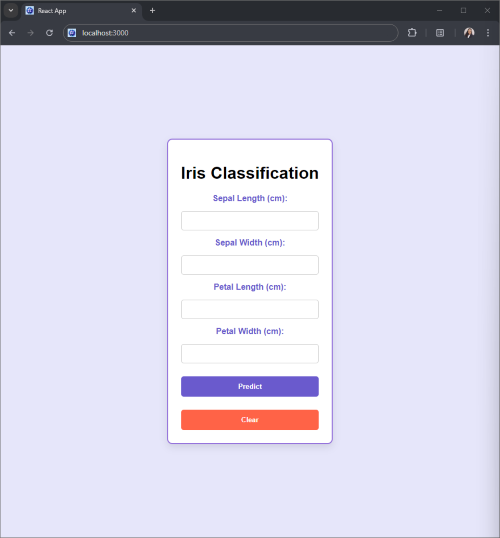
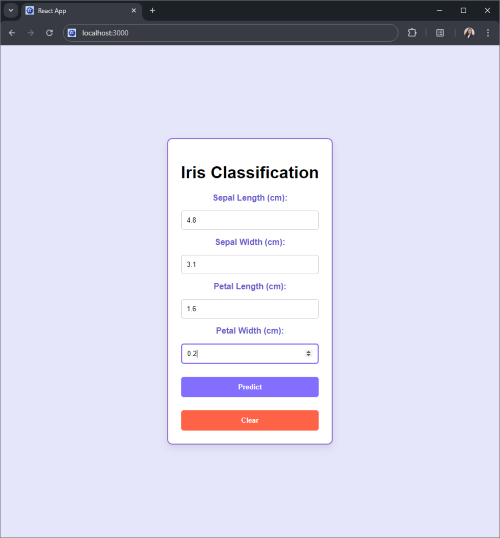
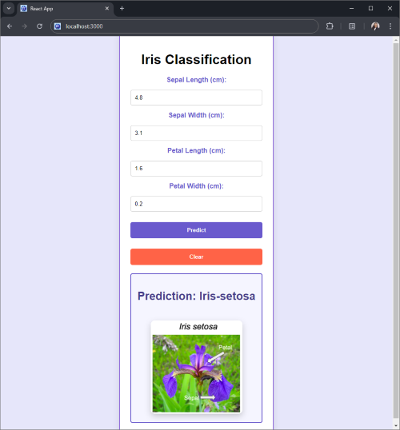

# Iris Flower Classification Application

This project is a full-stack application that predicts the species of an Iris flower based on user-provided sepal and petal dimensions. The application is powered by a **Random Forest Classifier** and features both a **React.js frontend** and a **Flask backend**.

## Table of Contents

1. [Project Overview](#project-overview)
2. [Features](#features)
3. [Screenshots](#screenshots)
4. [Tech Stack](#tech-stack)
5. [Project Structure](#project-structure)
6. [Installation & Setup](#installation--setup)

## Project Overview

The Iris flower classification problem is a standard classification task used in machine learning. The goal of this project is to classify an Iris flower into one of three species: **Iris-setosa**, **Iris-versicolor**, or **Iris-virginica**, based on four features: 
- Sepal Length
- Sepal Width
- Petal Length
- Petal Width

A **Random Forest Classifier** is used to predict the species based on the provided input values. The application consists of:
- A **React.js frontend** for user interaction and form submission.
- A **Flask backend** that serves the machine learning model for prediction.

## Features
- User inputs dimensions for sepal length, sepal width, petal length, and petal width.
- Predicts the Iris species and displays a corresponding image of the flower.
- Clear the form and reset predictions.
- Beautiful UI with **Iris-inspired color themes**.

## Screenshots

1. **Initial Form Interface**  
   

2. **Form with User Input**  
   

3. **Prediction Result with Image**  
   

## Tech Stack

### Frontend:
- **React.js**: For building the user interface.
- **CSS**: For styling the interface with a clean and modern look.

### Backend:
- **Flask**: To serve the machine learning model and handle API requests.
- **Joblib**: To load the pre-trained Random Forest model.
- **Scikit-learn**: Used to train the machine learning model.

### Machine Learning:
- **Random Forest Classifier**: The classifier used to predict the Iris species based on input features.

## Project Structure

```bash
Iris-Flower-Classification-Application/
├── iris-classification-frontend/   # React frontend
│   ├── public/
│   ├── src/
│   │   ├── components/
│   │   │   └── IrisForm.js        # Form for input and prediction
│   │   ├── styles/
│   │   │   └── style.css          # CSS for frontend styling
│   └── package.json
│
└── iris-classification-backend/    # Flask backend
    ├── app.py                     # Flask app logic and API endpoints
    ├── model/
    │   └── random_forest_model.pkl # Pre-trained Random Forest model
    ├── static/
    │   ├── Iris_setosa.png         # Image for Iris-setosa
    │   ├── Iris_versicolor.png     # Image for Iris-versicolor
    │   └── Iris_virginica.png      # Image for Iris-virginica
    └── requirements.txt            # Python dependencies
```

## Installation & Setup

### Backend Setup

1. **Clone the repository**:
   ```bash
   git clone https://github.com/IsharaParanagamaGedara/Iris-Flower-Classification.git
   cd iris-classification-backend
   ```

2. **Create a virtual environment**:
   ```bash
   python3 -m venv venv
   source venv/bin/activate  # On Windows use `venv\Scripts\activate`
   ```

3. **Install dependencies**:
   ```bash
   pip install -r requirements.txt
   ```

4. **Run the Flask server**:
   ```bash
   python app.py
   ```

   The Flask API should now be running at `http://127.0.0.1:5000/`.

### Frontend Setup

1. **Navigate to the frontend directory**:
   ```bash
   cd ../iris-classification-frontend
   ```

2. **Install frontend dependencies**:
   ```bash
   npm install
   ```

3. **Run the React development server**:
   ```bash
   npm start
   ```

   The React app should be running at `http://localhost:3000/`.


 
